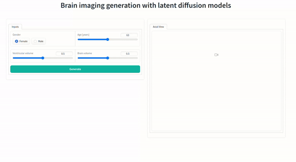

# Gradio App - Brain Image Synthesis with Latent Diffusion Models



### Instructions
1) Install codecs for ffmpeg
```shell
sudo apt install ubuntu-restricted-extras
sudo apt install ffmpeg
```

2) Create a virtual environment and install the dependencies
```shell
python3 -m venv venv
source venv/bin/activate
pip install -r requirements.txt
```

3) Clone MONAI Generative Models repository and install it
```shell
git clone https://github.com/Project-MONAI/GenerativeModels.git
cd GenerativeModels
pip install .
cd ..
```

4) Download the model weights to the `pretrained_models` directory
The models can be downloaded from [here](https://drive.google.com/uc?export=download&id=1XO-ak93ZuOcGTCpgRtqgIeZq3dG5ExN6)
and [here](https://drive.google.com/uc?export=download&id=1CZHwxHJWybOsDavipD0EorDPOo_mzNeX).

They should be place in 
```shell
gradio_medical_ldm/
    L pretrained_models/
        L autoencoder.pth
        L diffusion_model.pth
```

5) Run the app
```shell
gradio app.py
```

6) Open the app in your browser (tested with Chrome)

### Notes
The outputs directory contain the generated .nii.gz images.